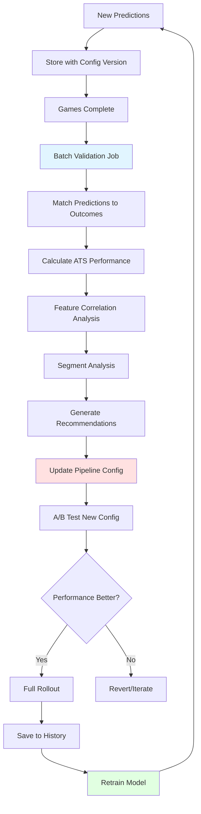
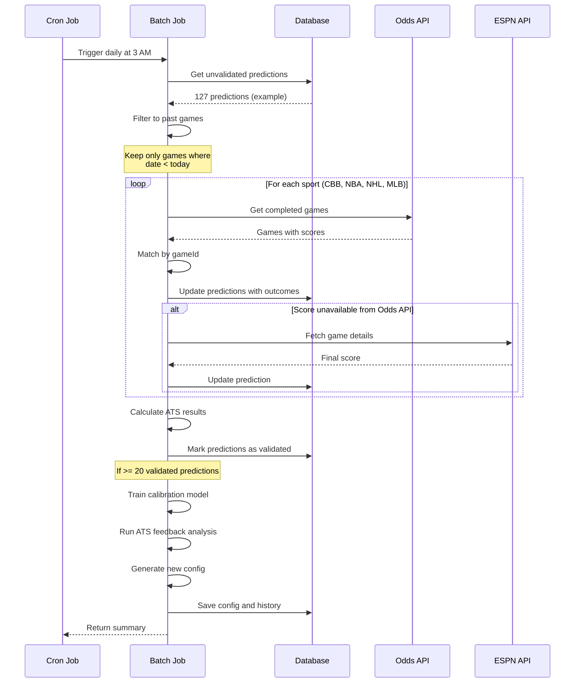
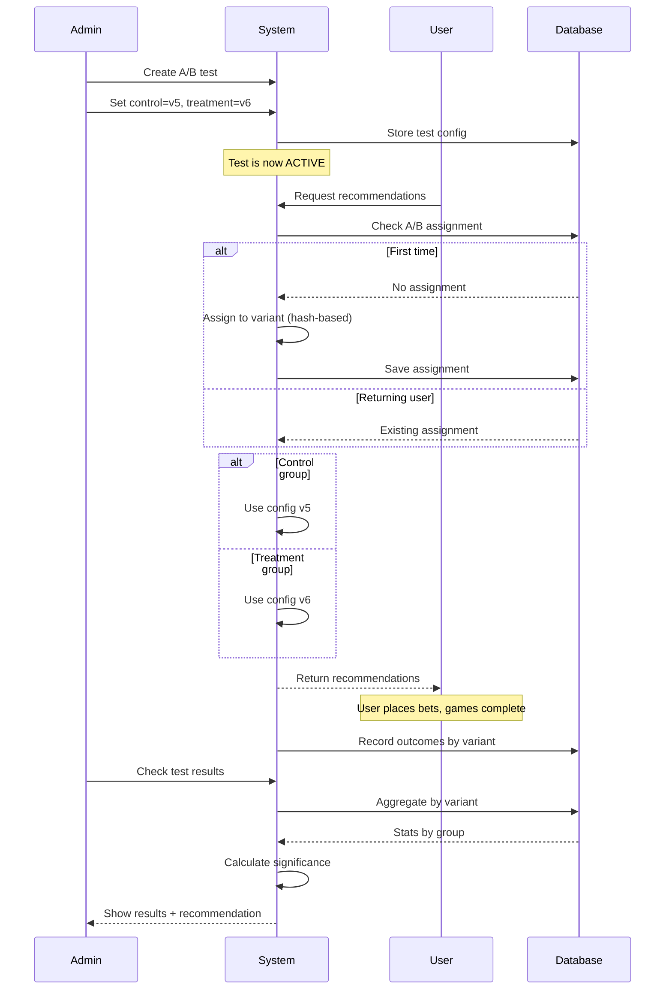

# Feedback Training Loop

This document explains how The Odds Oracle continuously learns and improves its predictions through automated feedback analysis and model retraining.

## Table of Contents

1. [Overview](#overview)
2. [Batch Validation Process](#batch-validation-process)
3. [ATS Feedback Analysis](#ats-feedback-analysis)
4. [Feature Importance](#feature-importance)
5. [Pipeline Configuration](#pipeline-configuration)
6. [A/B Testing](#ab-testing)
7. [Decision Engine Feedback](#decision-engine-feedback)
8. [Automated Retraining](#automated-retraining)

---

## Overview

The feedback loop is the "learning engine" that enables continuous improvement. It consists of several interconnected processes:



### Key Principles

1. **Continuous**: Runs automatically, no manual intervention
2. **Data-Driven**: All decisions based on statistical analysis
3. **Safe**: A/B testing before full rollout
4. **Traceable**: Every config version tracked with outcomes
5. **Reversible**: Can rollback if performance degrades

---

## Batch Validation Process

### Trigger

**Frequency**: Daily at 3 AM ET (via cron)

**Location**: `lib/prediction-feedback-batch.ts` → `runBatchSync()`

### Process Flow



### Matching Strategy

**Primary**: Odds API gameId match (most reliable)
```typescript
const completedGames = await getCompletedScoresBySport(sport);
const match = completedGames.find(g => g.id === prediction.gameId);
```

**Fallback**: ESPN API + team name matching
```typescript
const espnGames = await espnClient.getGamesByDate(date, sport);
const match = findBestMatch(prediction, espnGames);
```

**Match Confidence**:
- **Exact**: gameId match from same API
- **High**: Team names + date + score availability
- **Medium**: Team names fuzzy match + date  
- **Low**: Ambiguous, manual review needed
- **None**: Skip validation, retry next day

### Outcome Recording

```typescript
interface RecordedOutcome {
  predictionId: string;
  actualHomeScore: number;
  actualAwayScore: number;
  actualSpread: number;        // home - away
  actualTotal: number;         // home + away
  actualWinner: 'home' | 'away';
  
  // ATS calculations
  marketSpread: number;        // From prediction time
  predictedSpread: number;
  atsResult: 1 | -1 | 0;      // 1=win, -1=loss, 0=push
  netUnits: number;            // At -110 juice
  
  // CLV tracking
  closingSpread?: number;      // Final market spread
  clvBeat: boolean;           // Did we beat the close?
  
  validatedAt: Date;
}
```

**ATS Calculation**:
```typescript
// Determine which side we bet
const betOnHome = predictedSpread > 0;  // Positive = home favored

// Calculate cover margin
const coverMargin = betOnHome 
  ? actualSpread - (-marketSpread)     // Home perspective
  : (-marketSpread) - actualSpread;    // Away perspective

// Determine result
if (Math.abs(coverMargin) < 0.5) {
  atsResult = 0;  // Push
  netUnits = 0;
} else if (coverMargin > 0) {
  atsResult = 1;  // Win
  netUnits = 0.91;  // $91 profit on $100 bet at -110
} else {
  atsResult = -1;  // Loss  
  netUnits = -1.0;  // Lose $100
}
```

---

## ATS Feedback Analysis

### Purpose

Identify which features and segments are helping or hurting ATS performance.

**Location**: `lib/ats-feedback.ts` → `runATSFeedbackReport()`

### Analysis Components

#### 1. Overall Performance

```typescript
interface OverallPerformance {
  sampleCount: number;     // Total predictions with market spread
  wins: number;            // ATS wins
  losses: number;          // ATS losses
  pushes: number;          // ATS pushes
  winRate: number;         // wins / (wins + losses) * 100
  netUnits: number;        // Total profit/loss at -110
}
```

**Targets**:
- Win Rate: >52.4% (break-even at -110)
- Net Units: Positive over rolling 90-day window
- Sample Size: ≥100 for statistical confidence

#### 2. Feature Correlation

For each feature, calculate correlation with ATS success:

```typescript
interface FeatureCorrelation {
  feature: string;
  sampleCount: number;
  winRateAboveMedian: number;   // Win rate when feature > median
  winRateBelowMedian: number;   // Win rate when feature < median
  delta: number;                 // Difference (can be +/-)
  correlation: number;           // Pearson correlation (-1 to 1)
}
```

**Example**:
```
Feature: homeNetRating
Win Rate Above Median: 58.2%
Win Rate Below Median: 46.1%
Delta: +12.1%
Correlation: +0.24

Interpretation: High net rating correlates with ATS success
```

**Top 20 Features** (by |correlation|):
```
1. predictedTotal          r=-0.083  ↓  (High totals perform poorly)
2. momentumScore           r=+0.065  ↑  (Momentum helps)
3. spreadMagnitude         r=+0.061  ↑  (Larger spreads help)
4. fourFactorsScore        r=+0.052  ↑
5. spreadDiff              r=-0.050  ↓
6. totalScore              r=-0.044  ↓
7. homeWinProbRaw          r=+0.036  ↑
8. efficiencyScore         r=+0.032  ↑
9. homeWinProb             r=+0.027  ↑
10. confidence             r=+0.027  ↑
```

#### 3. Segmentation Analysis

Break down performance by key dimensions:

**By Sport**:
```
basketball_ncaab:  121-98  (55.3%)  +11.2u
basketball_nba:    28-31   (47.5%)  -4.3u
icehockey_nhl:     15-20   (42.9%)  -6.1u
```

**By Confidence Band**:
```
High (≥70):        42-35  (54.5%)  +4.1u
Medium (50-70):    89-82  (52.1%)  +3.7u
Low (<50):         33-47  (41.3%)  -15.9u  ⚠️
```

**By Spread Magnitude**:
```
Small (<3):        69-75  (47.9%)  -12.2u  ⚠️
Medium (3-7):      39-48  (44.8%)  -12.5u  ⚠️
Large (7-12):      31-22  (58.5%)  +6.8u
Very Large (≥12):  25-19  (56.8%)  +4.1u
```

**By Total Bucket**:
```
Low (<130):        12-15  (44.4%)  -4.2u
Medium (130-145):  3-8    (27.3%)  -5.3u   ⚠️
High (145-160):    45-37  (54.9%)  +5.1u
Very High (≥160):  73-81  (47.4%)  -14.6u  ⚠️
```

#### 4. Worst Performing Segments

**Definition**: Segments with <45% win rate and ≥10 samples

**Display**:
```
Segment                      Record    Win %   Net Units
─────────────────────────────────────────────────────────
totalBucket:medium(130-145)  3-8      27.3%   -5.27u  🔴
sport:basketball_nba          9-19     32.1%   -10.81u 🔴
spreadMagnitude:medium(3-7)   39-48    44.8%   -12.51u 🟠
confidenceBand:high(>=70)     47-55    46.1%   -12.23u 🟠
homeFavorite:home_favorite    86-98    46.7%   -19.74u 🟠
```

**Severity Colors**:
- 🔴 Red: <35% win rate (disable)
- 🟠 Orange: 35-45% win rate (downweight)
- 🟡 Yellow: 45-48% win rate (caution)

#### 5. Bias Analysis

**Types**:
```typescript
interface BiasAnalysis {
  segment: string;
  value: string;
  expectedWinRate: number;    // 52.4% (break-even)
  actualWinRate: number;
  bias: number;               // Difference
  weightedBias: number;       // Bias * sample size weight
  significant: boolean;       // Statistical significance
}
```

**Example**:
```
High Confidence Bets:
  Expected: 52.4%
  Actual: 46.1%
  Bias: -6.3%  ⚠️
  
  Interpretation: Overconfident - when we say high confidence,
                  we actually perform WORSE than average.
                  Need to recalibrate confidence scoring.
```

---

## Feature Importance

### Correlation-Based (Built-in)

**Method**: Pearson correlation coefficient

```typescript
correlation = 
  Σ((x_i - x̄)(y_i - ȳ)) / 
  √(Σ(x_i - x̄)² * Σ(y_i - ȳ)²)

where:
  x_i = feature value for prediction i
  y_i = ATS outcome (1=win, 0=loss)
```

**Advantages**:
- Fast to compute
- Easy to interpret
- No dependencies

**Limitations**:
- Assumes linear relationships
- Doesn't account for feature interactions
- No p-values for significance

### Regression-Based (Advanced - TensorFlow)

**Method**: L1-regularized logistic regression

**Location**: `lib/ml-analytics.ts` → `logisticRegressionFeatureImportance()`

**Process**:
1. Extract 33 features for each ATS sample
2. Create feature matrix X (n_samples × 33)
3. Create target vector y (1=win, 0=loss)
4. Train logistic regression with L1 penalty
5. Extract coefficients (feature weights)

```typescript
// TensorFlow.js implementation
const model = tf.sequential({
  layers: [
    tf.layers.dense({
      inputShape: [33],
      units: 1,
      activation: 'sigmoid',
      kernelRegularizer: tf.regularizers.l1({ l1: 0.01 }),
    }),
  ],
});

model.compile({
  optimizer: tf.train.adam(0.01),
  loss: 'binaryCrossentropy',
  metrics: ['accuracy'],
});

await model.fit(X, y, {
  epochs: 100,
  batchSize: 32,
  validationSplit: 0.2,
  verbose: 0,
});

const weights = model.layers[0].getWeights()[0];
const coefficients = await weights.data();
```

**Output**:
```typescript
interface RegressionFeatureImportance {
  feature: string;
  coefficient: number;       // +/- impact on log-odds
  absCoefficient: number;    // For ranking
  pValue: number;            // Statistical significance
  significant: boolean;      // p < 0.05
}
```

**Advantages**:
- Captures non-linear relationships
- Accounts for feature interactions
- L1 regularization = automatic feature selection
- Statistical significance testing

**Use Case**: 
- Identify truly predictive features
- Remove noise features (coefficient ≈ 0)
- Guide manual feature engineering

---

## Pipeline Configuration

### Purpose

Dynamically adjust how predictions are used based on feedback.

**Location**: `lib/feedback-pipeline-config.ts`

### Configuration Structure

```typescript
interface FeedbackPipelineConfig {
  version: number;           // Incremented on each update
  updatedAt: string;        // ISO timestamp
  
  // Validation mode
  validationMode?: 'live' | 'shadow' | 'ab_test';
  abTestName?: string;
  abTestVariant?: 'control' | 'treatment';
  
  // Sport-specific adjustments
  sports: {
    basketball_ncaab: SportConfig;
    basketball_nba: SportConfig;
    icehockey_nhl: SportConfig;
    baseball_mlb: SportConfig;
  };
  
  // Spread magnitude adjustments
  spreadMagnitude: {
    smallSpread: BucketConfig;     // |spread| < 3
    mediumSpread: BucketConfig;    // 3 <= |spread| < 7
    largeSpread: BucketConfig;     // 7 <= |spread| < 12
    veryLargeSpread: BucketConfig; // |spread| >= 12
  };
  
  // Total bucket adjustments
  totalBucket: {
    lowTotal: BucketConfig;       // total < 130
    mediumTotal: BucketConfig;    // 130-145
    highTotal: BucketConfig;      // 145-160
    veryHighTotal: BucketConfig;  // >= 160
  };
  
  // Confidence band adjustments
  confidenceBands: {
    low: BucketConfig;     // < 50
    medium: BucketConfig;  // 50-70
    high: BucketConfig;    // >= 70
  };
  
  // Feature weight overrides
  featureWeights: {
    significanceThreshold: number;
    overrides: Record<string, number>;
  };
  
  // Global settings
  global: {
    minSampleSizeForAdjustment: number;
    winRateThresholdForDisable: number;
    winRateThresholdForDownweight: number;
    targetWinRate: number;
  };
}

interface SportConfig {
  enabled: boolean;
  confidenceMultiplier: number;  // 0.0-1.5
  minConfidenceThreshold: number;
}

interface BucketConfig {
  enabled: boolean;
  confidenceMultiplier: number;
}
```

### Automatic Config Generation

**Location**: `lib/feedback-pipeline-config.ts` → `generateConfigFromFeedback()`

**Algorithm**:
```typescript
for each segment in feedback.segmentations:
  if segment.decided >= minSampleSize:
    if segment.winRate < disableThreshold (35%):
      → segment.enabled = false
      → recommendation: "DISABLE {segment}"
      
    else if segment.winRate < downweightThreshold (45%):
      → segment.confidenceMultiplier = 0.75
      → recommendation: "DOWNWEIGHT {segment}"
      
    else if segment.winRate > boostThreshold (60%):
      → segment.confidenceMultiplier = 1.25
      → recommendation: "BOOST {segment}"
      
    else:
      → segment.confidenceMultiplier = 1.0
      → recommendation: "MAINTAIN {segment}"
```

**Example Output**:
```typescript
{
  version: 6,
  updatedAt: '2024-03-01T10:30:00Z',
  
  sports: {
    basketball_ncaab: {
      enabled: true,
      confidenceMultiplier: 1.25,  // BOOST (55% win rate)
      minConfidenceThreshold: 0
    },
    basketball_nba: {
      enabled: true,
      confidenceMultiplier: 0.75,  // DOWNWEIGHT (47.5% win rate)
      minConfidenceThreshold: 50   // Require 50+ confidence
    },
    icehockey_nhl: {
      enabled: false,              // DISABLE (42.9% win rate)
      confidenceMultiplier: 1.0,
      minConfidenceThreshold: 0
    }
  },
  
  spreadMagnitude: {
    smallSpread: {
      enabled: true,
      confidenceMultiplier: 0.75   // DOWNWEIGHT (47.9% win rate)
    },
    largeSpread: {
      enabled: true,
      confidenceMultiplier: 1.25   // BOOST (58.5% win rate)
    }
  }
}
```

### Config Application

**Location**: `lib/recommended-bets-aggregator.ts` → `applyConfigToConfidence()`

**Process**:
```typescript
function applyPipelineConfig(
  predictions: Prediction[],
  config: FeedbackPipelineConfig
): Prediction[] {
  return predictions
    .map(pred => {
      let adjustedConfidence = pred.confidence;
      
      // Apply sport multiplier
      const sportKey = getSportKey(pred.sport);
      const sportConfig = config.sports[sportKey];
      if (!sportConfig.enabled) return null;  // Filter out
      adjustedConfidence *= sportConfig.confidenceMultiplier;
      
      // Apply spread magnitude multiplier
      const spreadBucket = getSpreadBucket(pred.predictedSpread);
      const spreadConfig = config.spreadMagnitude[spreadBucket];
      if (!spreadConfig.enabled) return null;
      adjustedConfidence *= spreadConfig.confidenceMultiplier;
      
      // Apply total bucket multiplier
      const totalBucket = getTotalBucket(pred.predictedTotal);
      const totalConfig = config.totalBucket[totalBucket];
      if (!totalConfig.enabled) return null;
      adjustedConfidence *= totalConfig.confidenceMultiplier;
      
      // Apply confidence band multiplier
      const confBand = getConfidenceBand(pred.confidence);
      const bandConfig = config.confidenceBands[confBand];
      if (!bandConfig.enabled) return null;
      adjustedConfidence *= bandConfig.confidenceMultiplier;
      
      // Clamp to 0-100
      adjustedConfidence = Math.max(0, Math.min(100, adjustedConfidence));
      
      return {
        ...pred,
        adjustedConfidence,
        configVersion: config.version
      };
    })
    .filter(p => p !== null)
    .filter(p => p.adjustedConfidence >= sportConfig.minConfidenceThreshold)
    .sort((a, b) => b.adjustedConfidence - a.adjustedConfidence);
}
```

---

## A/B Testing

### Purpose

Validate config changes before full rollout to prevent performance degradation.

**Location**: `lib/ab-testing.ts`

### User Assignment

**Method**: Deterministic hashing

```typescript
function assignUserToVariant(
  userId: string,
  testName: string
): 'control' | 'treatment' {
  // Check existing assignment
  const existing = await db.findAssignment(userId, testName);
  if (existing) return existing.variant;
  
  // Hash userId + testName for deterministic assignment
  const hash = hashString(userId + testName);
  const variant = hash % 2 === 0 ? 'control' : 'treatment';
  
  // Store assignment
  await db.saveAssignment(userId, testName, variant);
  
  return variant;
}
```

**Properties**:
- Consistent: Same user always gets same variant
- Balanced: ~50/50 split over large sample
- Independent: Different tests are uncorrelated

### Test Flow



### Outcome Tracking

```typescript
interface ABTestResult {
  testName: string;
  variant: 'control' | 'treatment';
  userId: string;
  
  // Per-prediction outcomes
  predictionId: string;
  atsResult: 1 | -1 | 0;
  netUnits: number;
  recordedAt: Date;
}
```

### Results Analysis

**Location**: `lib/ab-testing.ts` → `getABTestResults()`

**Metrics**:
```typescript
interface TestResults {
  control: {
    count: number;
    avgNetUnits: number;
    wins: number;
    losses: number;
    winRate: number;
  };
  treatment: {
    count: number;
    avgNetUnits: number;
    wins: number;
    losses: number;
    winRate: number;
  };
  improvement: {
    netUnits: number;      // treatment - control
    winRate: number;       // percentage points
  };
}
```

### Statistical Significance

**Method**: Chi-square test for proportions

```typescript
function calculateSignificance(
  controlWins: number,
  controlLosses: number,
  treatmentWins: number,
  treatmentLosses: number
): { chiSquare: number; pValue: number; significant: boolean } {
  const n1 = controlWins + controlLosses;
  const n2 = treatmentWins + treatmentLosses;
  
  // Pooled win rate
  const pooledWinRate = (controlWins + treatmentWins) / (n1 + n2);
  
  // Expected values
  const expectedControlWins = n1 * pooledWinRate;
  const expectedControlLosses = n1 * (1 - pooledWinRate);
  const expectedTreatmentWins = n2 * pooledWinRate;
  const expectedTreatmentLosses = n2 * (1 - pooledWinRate);
  
  // Chi-square statistic
  const chiSquare = 
    Math.pow(controlWins - expectedControlWins, 2) / expectedControlWins +
    Math.pow(controlLosses - expectedControlLosses, 2) / expectedControlLosses +
    Math.pow(treatmentWins - expectedTreatmentWins, 2) / expectedTreatmentWins +
    Math.pow(treatmentLosses - expectedTreatmentLosses, 2) / expectedTreatmentLosses;
  
  // p-value (using chi-square CDF)
  const pValue = 1 - chiSquareCDF(chiSquare, 1);
  
  return {
    chiSquare,
    pValue,
    significant: pValue < 0.05  // 95% confidence
  };
}
```

**Interpretation**:
- p < 0.05: Significant difference (can confidently rollout)
- p ≥ 0.05: Not significant (need more data or revert)

**Minimum Sample Size**: 200 predictions per variant

---

## Decision Engine Feedback

### Purpose

Track portfolio-level performance, not just individual bets.

**Location**: `lib/decision-engine-tracking.ts`

### Decision Engine Run Tracking

Every time the decision engine constructs a portfolio, we track:

```typescript
interface DecisionEngineRun {
  id: string;
  userId: string;
  timestamp: Date;
  
  // Inputs
  bankroll: number;
  sport: string;
  configVersion: number;
  candidateCount: number;
  
  // Outputs
  selectedCount: number;
  selectedSlate: PortfolioPosition[];
  alternatives: RejectedBet[];       // For regret analysis
  constraints: DecisionEngineConstraints;
  
  // Outcomes (populated later)
  validated: boolean;
  actualATS: number;                 // Portfolio-level win rate
  actualNetUnits: number;
  maxDrawdown: number;
  avgCorrelation: number;            // Realized vs predicted
}
```

### Validation Process

**Trigger**: Batch validation job

**Process**:
1. Get unvalidated decision engine runs
2. For each run:
   - Get selected positions
   - Match positions to validated predictions
   - Calculate ATS result for each position
   - Compute net units for each position
3. Aggregate portfolio metrics:
   - Overall ATS win rate
   - Total net units
   - Max drawdown
4. Mark run as validated

**Code**:
```typescript
async function validateDecisionEngineRun(
  runId: string,
  outcomes: Array<{
    positionIndex: number;
    predictionId: string;
    atsResult: 1 | -1 | 0;
    netUnits: number;
  }>
) {
  // Calculate portfolio metrics
  const totalNetUnits = outcomes.reduce((sum, o) => sum + o.netUnits, 0);
  const atsWins = outcomes.filter(o => o.atsResult === 1).length;
  const atsLosses = outcomes.filter(o => o.atsResult === -1).length;
  const decidedCount = atsWins + atsLosses;
  const atsRate = decidedCount > 0 ? (atsWins / decidedCount) * 100 : 0;
  
  // Calculate drawdown
  let runningSum = 0;
  let peak = 0;
  let maxDrawdown = 0;
  
  for (const outcome of outcomes) {
    runningSum += outcome.netUnits;
    if (runningSum > peak) peak = runningSum;
    const drawdown = peak - runningSum;
    if (drawdown > maxDrawdown) maxDrawdown = drawdown;
  }
  
  // Update run
  await db.updateRun(runId, {
    validated: true,
    actualATS: atsRate,
    actualNetUnits: totalNetUnits,
    maxDrawdown
  });
}
```

### Performance Analysis

**API**: `/api/admin/decision-engine/performance`

**Metrics**:
```typescript
{
  configVersion: number;
  performance: {
    avgPositions: number;          // Average bets per slate
    portfolioWinRate: number;      // Portfolio-level ATS
    avgNetUnits: number;           // Average profit per run
    vsControl: {
      improvement: number          // vs previous version
    };
    runCount: number;
  };
  recentRuns: Run[];
}
```

**Dashboard**: Shows trends over time, comparison between config versions

### Regret Analysis

**Definition**: Performance of rejected bets that would have won

**Purpose**: Identify if we're leaving money on the table

**Process**:
1. For each decision engine run
2. Get rejected alternatives (with reasons)
3. Match alternatives to actual outcomes
4. Calculate what we would have won
5. Compare to what we actually won

**Insights**:
- Are correlation limits too strict?
- Are we over-diversifying?
- Should we increase position sizes?

---

## Automated Retraining

### Trigger Conditions

Retraining occurs when:
1. ≥20 new validated predictions since last training
2. Daily batch job completes successfully
3. Manual trigger from admin panel

### Training Process

**Location**: `lib/prediction-feedback-batch.ts` → `runBatchSync()`

```mermaid
graph TD
    A[Get Validated Predictions] --> B{>= 20 samples?}
    B -->|No| C[Skip Training]
    B -->|Yes| D[Fit Platt Scaling]
    D --> E[Save Calibration Params]
    E --> F[Calculate Bias Correction]
    F --> G[Save Bias Params]
    G --> H[Estimate Variance Model]
    H --> I[Save Variance Params]
    I --> J[Build Training Dataset]
    J --> K[Run Evaluation Metrics]
    K --> L[Run ATS Feedback Analysis]
    L --> M[Generate Pipeline Config]
    M --> N[Save Config v{N+1}]
    N --> O[Save Feedback History]
    O --> P[Log Summary]
    
    style D fill:#ffe1e1
    style M fill:#e1ffe1
    style O fill:#e1f5ff
```

### Platt Scaling Update

**Input**: All validated predictions with outcomes

**Process**:
```typescript
const pairs = validated.map(v => ({
  homeWinProb: v.prediction.winProbability.home,
  actualWinner: v.actualOutcome.winner
}));

const params = fitPlattScaling(pairs);

// Result: { A: number, B: number }
// P_calibrated = 1 / (1 + exp(A * logit(P_raw) + B))

await saveCalibrationParams(params);
```

**Application**: All future predictions use new A, B coefficients

### Bias Correction Update

**Input**: Last 90 days of validated predictions

**Process**:
```typescript
const report = await generatePerformanceReport(90);

const biases = {
  homeTeamBias: report.avgHomeError,      // e.g., +1.2 (over-predict home)
  awayTeamBias: report.avgAwayError,      // e.g., -0.3
  scoreBias: report.avgTotalError         // e.g., +1.5 (over-predict totals)
};

await saveBiasCorrection(biases);
```

**Application**: Subtracted from raw predictions going forward

### Pipeline Config Update

**Input**: ATS feedback report

**Process**:
1. Analyze segment performance
2. Generate recommendations
3. Create new config (version N+1)
4. Save to database
5. Log to feedback history

**Automatic Application**:
- Immediately affects `/api/recommended-bets`
- Config version tagged on all new predictions
- Can be reverted if performance degrades

### Feedback History Recording

**Purpose**: Track performance over time, enable trend analysis

```typescript
await saveFeedbackHistory(
  atsReport,
  configVersion,
  sport,
  {
    brierScore: metrics.brierScore,
    logLoss: metrics.logLoss,
    spreadMAE: metrics.spreadMAE
  }
);
```

**Stored**:
- Timestamp
- Config version
- Overall performance (wins, losses, net units)
- Top 10 feature importance
- Performance by sport
- Calibration metrics

**Usage**:
- Admin dashboard: `/admin/ats-feedback?trends=true`
- Compare config versions
- Identify performance trends
- Validate improvements

---

## Monitoring & Alerts

### Key Metrics Tracked

1. **Validation Rate**: % of predictions successfully validated
   - Target: >95%
   - Alert: <90%

2. **ATS Win Rate**: Rolling 30/60/90 day win rate
   - Target: >52.4%
   - Alert: <50% for 7+ days

3. **Net Units**: Cumulative profit/loss
   - Target: Positive trend
   - Alert: Drawdown >20 units

4. **Data Freshness**: Time since last validation
   - Target: <24 hours
   - Alert: >48 hours

5. **Model Performance**:
   - Brier score: Target <0.20
   - Log loss: Target <0.65
   - Calibration slope: Target 0.9-1.1

### Alert Conditions

```typescript
if (rollingWinRate30Day < 50 && sampleSize >= 50) {
  sendAlert('ATS_PERFORMANCE_DEGRADED', {
    winRate: rollingWinRate30Day,
    netUnits: rollingNetUnits30Day,
    configVersion: currentConfigVersion
  });
}

if (validationRate < 90) {
  sendAlert('VALIDATION_FAILURE', {
    rate: validationRate,
    failedCount: failedValidations
  });
}

if (timeSinceLastTraining > 72 * 3600 * 1000) {
  sendAlert('TRAINING_OVERDUE', {
    hoursSince: timeSinceLastTraining / 3600 / 1000
  });
}
```

### Admin Dashboard

**Location**: `/admin/ats-feedback`

**Features**:
- Overall performance summary
- Feature importance table
- Worst performing segments
- Recommended adjustments
- Pipeline config management
- Generate/Apply/Reset config
- Historical trends chart
- Config version comparison

---

## Summary

The feedback training loop is a sophisticated, fully automated system that:

1. **Validates** predictions against actual outcomes daily
2. **Analyzes** performance across 50+ features and multiple dimensions
3. **Identifies** what's working and what's not through statistical analysis
4. **Adjusts** the pipeline configuration to optimize future performance
5. **Tests** changes via A/B testing before full rollout
6. **Tracks** everything for transparency and reversibility
7. **Retrains** calibration models to maintain accuracy
8. **Improves** continuously without manual intervention

This creates a virtuous cycle where the system gets smarter with every prediction.

**Key Innovation**: Config versioning + feedback history enables scientific experimentation and continuous improvement.

Previous: [← Prediction Architecture](PREDICTION_ARCHITECTURE.md) | Next: [Implementation Details →](IMPLEMENTATION_SUMMARY.md)
