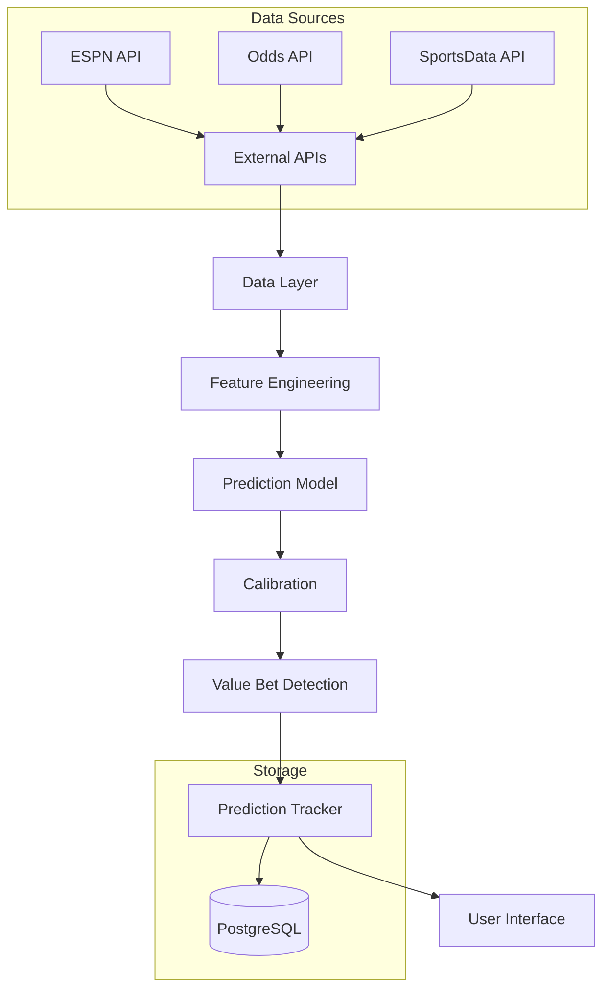
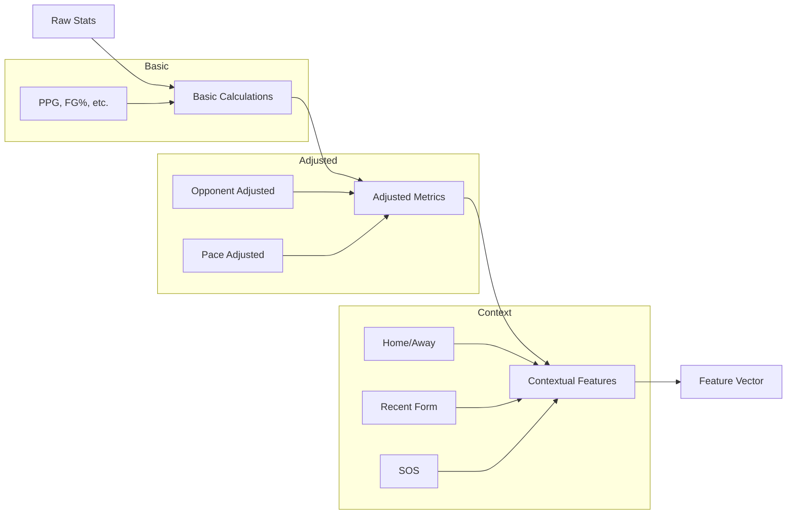
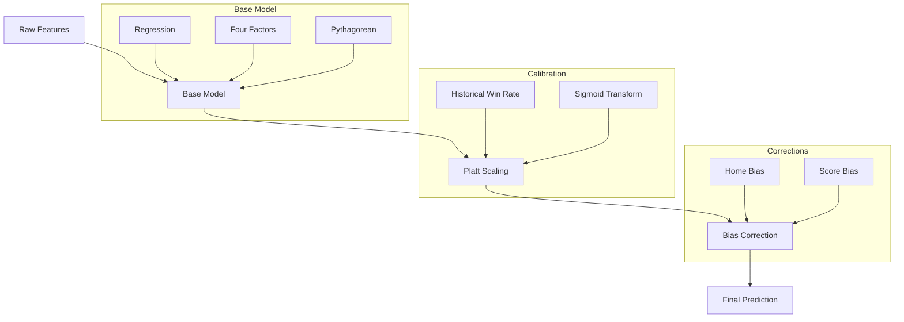
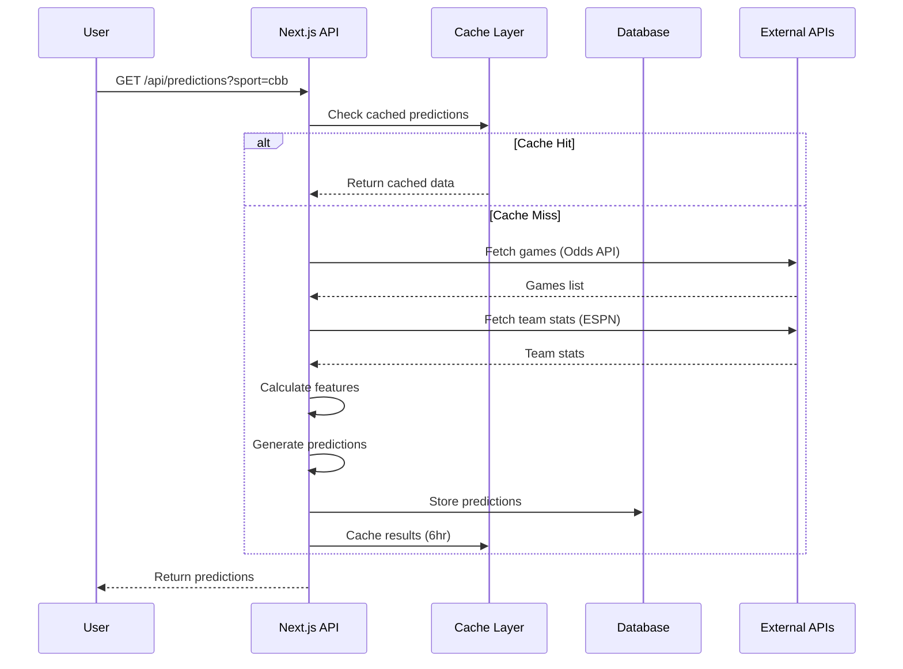

# Prediction System Architecture

This document explains how The Odds Oracle generates predictions, from raw data to actionable betting recommendations.

## Table of Contents

1. [System Overview](#system-overview)
2. [Data Pipeline](#data-pipeline)
3. [Feature Engineering](#feature-engineering)
4. [Prediction Models](#prediction-models)
5. [Calibration & Confidence](#calibration--confidence)
6. [Value Bet Identification](#value-bet-identification)
7. [API Flow](#api-flow)

---

## System Overview

The prediction system (Brain A) is responsible for:
- Ingesting raw team statistics and game data
- Computing advanced analytics (50+ features)
- Generating win probabilities and spread predictions
- Identifying value betting opportunities
- Tracking predictions for validation

### High-Level Architecture



---

## Data Pipeline

### 1. Game Data Collection

**Source**: Odds API (`lib/odds-api.ts`)

```typescript
interface Game {
  id: string;
  sport_key: string;
  commence_time: string;
  home_team: string;
  away_team: string;
  bookmakers: Bookmaker[];
}
```

**Process**:
1. Fetch upcoming games for target sports (CBB, NBA, NHL, MLB)
2. Extract consensus betting lines (spread, total, moneyline)
3. Store in `TrackedGame` table
4. Trigger prediction generation

### 2. Team Statistics Collection

**Sources**: 
- ESPN API: Basic stats, recent games
- SportsData API: Advanced metrics (when available)

**Frequency**:
- Daily batch update: All teams
- Real-time: On prediction request
- Cached: 6-hour TTL

### 3. Historical Data

**Storage**: `Prediction` table
- All past predictions with outcomes
- Used for training and validation
- Includes feature snapshot for each game

---

## Feature Engineering

### Feature Categories (50+ total)

#### 1. Base Ratings (4 features)
```typescript
{
  netRating: number;           // Points per 100 possessions differential
  offensiveRating: number;     // Points scored per 100 possessions
  defensiveRating: number;     // Points allowed per 100 possessions
  pace: number;                // Possessions per game
}
```

#### 2. Efficiency Metrics (6 features)
```typescript
{
  offensiveEfficiency: number;      // FG% * 100
  defensiveEfficiency: number;      // Opponent FG% * 100
  adjustedOffensiveEfficiency: number; // Adjusted for opponent defense
  adjustedDefensiveEfficiency: number; // Adjusted for opponent offense
  trueShootingPct: number;         // TS% = PTS / (2 * (FGA + 0.44 * FTA))
  effectiveFGPct: number;          // eFG% = (FG + 0.5 * 3P) / FGA
}
```

#### 3. Momentum & Trends (8 features)
```typescript
{
  momentum: number;                    // Weighted recent performance (-1 to 1)
  winStreak: number;                   // Current win streak
  lossStreak: number;                  // Current loss streak
  last5Wins: number;                   // Wins in last 5 games
  last5Losses: number;                 // Losses in last 5 games
  recentFormOffensiveEfficiency: number;
  recentFormDefensiveEfficiency: number;
  streakImpact: number;                // Impact of current streak
}
```

#### 4. Shooting Metrics (9 features)
```typescript
{
  shootingEfficiency: number;      // Overall FG%
  threePointPct: number;          // 3P%
  threePointThreat: number;       // 3PA per game * 3P%
  freeThrowPct: number;           // FT%
  freeThrowReliability: number;   // FTA per game * FT%
  twoPointPct: number;            // 2P%
  fieldGoalAttempts: number;      // FGA per game
  threePointAttempts: number;     // 3PA per game
  freeThrowAttempts: number;      // FTA per game
}
```

#### 5. Game Flow Metrics (7 features)
```typescript
{
  reboundingAdvantage: number;        // TRB per game
  offensiveRebounds: number;          // ORB per game
  defensiveRebounds: number;          // DRB per game
  assistToTurnoverRatio: number;      // AST / TOV
  assists: number;                    // AST per game
  turnovers: number;                  // TOV per game
  steals: number;                     // STL per game
}
```

#### 6. Context & Adjustments (10+ features)
```typescript
{
  strengthOfSchedule: number;      // Average opponent net rating
  homeAdvantage: number;           // Home court advantage (points)
  consistency: number;             // Standard deviation of point differentials
  clutchPerformance: number;       // Performance in close games
  restDays: number;               // Days since last game
  travelDistance: number;          // Miles traveled (if available)
  conferencePower: number;         // Conference strength rating
  seasonProgress: number;          // % of season complete
  injuryImpact: number;           // Estimated impact of injuries
  coachingEffect: number;          // Historical coach performance
}
```

### Feature Computation Flow



**Implementation**: `lib/advanced-analytics.ts` → `calculateTeamAnalytics()`

---

## Prediction Models

### Model Hierarchy



### 1. Base Prediction Model

**Location**: `lib/advanced-analytics.ts` → `predictMatchup()`

**Approach**: Ensemble of methods

#### Method A: Net Rating Regression
```typescript
// Points differential prediction based on net ratings
const predictedMargin = 
  (homeAnalytics.netRating - awayAnalytics.netRating) * 0.8 +
  homeAdvantage;
```

#### Method B: Four Factors Model
Basketball's "Four Factors" (Dean Oliver):
1. Shooting (40% weight): eFG%
2. Turnovers (25% weight): TOV%
3. Rebounding (20% weight): ORB%
4. Free Throws (15% weight): FT/FGA

```typescript
const fourFactorsScore = 
  0.40 * shootingFactor +
  0.25 * turnoverFactor +
  0.20 * reboundingFactor +
  0.15 * freeThrowFactor;
```

#### Method C: Pythagorean Expectation
```typescript
// Expected win percentage based on points scored/allowed
const pythWinPct = 
  Math.pow(pointsFor, 13.91) / 
  (Math.pow(pointsFor, 13.91) + Math.pow(pointsAgainst, 13.91));
```

#### Ensemble Weighting
```typescript
const finalPrediction = 
  0.50 * netRatingPrediction +
  0.30 * fourFactorsPrediction +
  0.20 * pythagoreanPrediction;
```

### 2. Win Probability Calculation

**Raw probability from margin**:
```typescript
// Logistic function: margin → probability
const rawProb = 1 / (1 + Math.exp(-predictedMargin / 12));
```

### 3. Platt Scaling (Calibration)

**Location**: `lib/recalibration.ts`

**Purpose**: Maps raw probabilities to calibrated probabilities

**Method**: Fit sigmoid to historical predictions
```typescript
P_calibrated = 1 / (1 + exp(A * log(P_raw / (1 - P_raw)) + B))
```

**Training**:
- Collect all historical predictions with outcomes
- Fit A and B coefficients to maximize likelihood
- Persist in `ModelConfig` table
- Auto-retrain on batch validation

**Effect**: 
- If model overconfident → flatten probabilities
- If model underconfident → steepen probabilities
- Target: Brier score minimization

### 4. Bias Correction

**Location**: `lib/recommendation-engine.ts`

**Types of bias detected**:
```typescript
interface BiasCorrection {
  homeTeamBias: number;    // e.g., +1.5 points (favors home too much)
  awayTeamBias: number;    // e.g., -0.8 points
  scoreBias: number;       // e.g., +2.1 (predicts totals too high)
}
```

**Application**:
```typescript
correctedHomeScore = predictedHomeScore - biasCorrection.homeTeamBias;
correctedAwayScore = predictedAwayScore - biasCorrection.awayTeamBias;
correctedTotal = correctedHomeScore + correctedAwayScore;
```

---

## Calibration & Confidence

### Confidence Score (0-100)

**Factors**:
```typescript
confidence = baseConfidence * adjustments;

where:
  baseConfidence = 50 + |predictedSpread| * 3  // Larger spread = more confident
  
  adjustments *= dataQualityFactor    // 0.7-1.0 based on data completeness
  adjustments *= sampleSizeFactor     // 0.8-1.0 based on games played
  adjustments *= modelAgreement       // 0.9-1.0 if methods agree
  adjustments *= historicalAccuracy   // 0.85-1.0 based on recent performance
```

**Interpretation**:
- 0-30: Very low confidence (insufficient data)
- 30-50: Low confidence (consider avoiding)
- 50-70: Medium confidence (typical)
- 70-85: High confidence (strong indicators align)
- 85-100: Very high confidence (rare, exceptional cases)

### Calibration Quality Metrics

**Brier Score**: 
```typescript
brierScore = (1/N) * Σ(predicted_prob - actual_outcome)²
```
- Lower is better (0 = perfect, 0.25 = random)
- Target: <0.20 for good calibration

**Log Loss**:
```typescript
logLoss = -(1/N) * Σ(y * log(p) + (1-y) * log(1-p))
```
- Lower is better
- Penalizes confident wrong predictions heavily

**Calibration Curve**:
Plot predicted probability vs actual win rate
- Perfect calibration: y = x line
- Overconfident: Curve below line
- Underconfident: Curve above line

---

## Value Bet Identification

### Value Definition

A bet has "value" when:
```
Our Probability > Implied Probability from Odds
```

**Example**:
```typescript
Market: Team A -5.5 (-110)
Our Prediction: Team A -7.2 (implies 72% win probability)

Market Implied Probability: 
  110/210 = 52.4% (break-even at -110)

Edge = 72% - 52.4% = 19.6% edge!
```

### Value Bet Detection

**Location**: `lib/recommendation-engine.ts` → `recommendBetsForGame()`

**Process**:
1. Get our prediction (spread, probability, confidence)
2. Get market lines from multiple bookmakers
3. Calculate implied probability for each market
4. Compare our probability to market
5. Flag if edge exceeds threshold

**Thresholds**:
```typescript
const VALUE_BET_THRESHOLDS = {
  minEdge: 0.05,           // 5% minimum edge
  minConfidence: 50,       // Don't bet if confidence <50
  maxSpreadDeviation: 5,   // Don't bet if spread differs >5 points
};
```

### Favorable Bet Scoring

**Location**: `lib/favorable-bet-engine.ts`

**Scoring Algorithm**:
```typescript
favorableScore = 
  edgeWeight * normalizedEdge +
  confidenceWeight * normalizedConfidence +
  lineValueWeight * normalizedLineValue +
  historyWeight * normalizedHistoricalAccuracy;

where:
  edgeWeight = 0.40        // Most important
  confidenceWeight = 0.30  // Second most important
  lineValueWeight = 0.20   // Closing line value matters
  historyWeight = 0.10     // Recent track record
```

**Rating Tiers**:
- S-Tier: Score ≥ 85 (exceptional value)
- A-Tier: Score 70-84 (strong value)
- B-Tier: Score 55-69 (good value)
- C-Tier: Score 40-54 (mild value)
- Below 40: Not recommended

---

## API Flow

### End-to-End Request Flow



### Key API Endpoints

#### 1. **Generate Predictions**
```
GET /api/predictions?sport={sport}&date={date}
```

**Flow**:
1. Fetch upcoming games for sport
2. For each game:
   - Get team analytics
   - Calculate features
   - Generate prediction
   - Store in `Prediction` table
3. Return predictions array

#### 2. **Get Recommended Bets**
```
GET /api/recommended-bets?sport={sport}&limit={n}
```

**Flow**:
1. Get recent predictions (last 7 days)
2. For each prediction:
   - Fetch current betting lines
   - Calculate edge vs market
   - Score favorable bets
3. Sort by favorable score
4. Apply pipeline config adjustments
5. Return top N recommendations

#### 3. **Track Prediction**
```
POST /api/predictions/track
Body: { gameId, prediction, options }
```

**Flow**:
1. Check for duplicate (game + not validated)
2. Store in `Prediction` table with:
   - Predicted scores, spread, total
   - Win probabilities
   - Confidence score
   - Feature snapshot
   - Config version
   - Recommendation tier
3. Return prediction ID

### Caching Strategy

**Layers**:
1. **Memory Cache**: In-process LRU cache
   - Team analytics: 1 hour
   - Game data: 15 minutes
   - Max size: 500 items

2. **Redis** (if configured):
   - Predictions: 6 hours
   - Team stats: 2 hours
   - Odds data: 5 minutes

3. **Database**:
   - Historical predictions
   - Validated outcomes
   - Training data

**Cache Invalidation**:
- On prediction generation: Invalidate old predictions
- On stats update: Invalidate affected teams
- On game completion: Invalidate game data

---

## Error Handling & Resilience

### Data Quality Checks

```typescript
interface DataQualityScore {
  completeness: number;  // 0-1: % of required fields present
  freshness: number;     // 0-1: How recent is the data
  consistency: number;   // 0-1: Internal consistency checks
  overall: number;       // Weighted average
}
```

**Minimum Thresholds**:
- Don't generate prediction if overall quality <0.6
- Warn user if quality 0.6-0.8
- Normal operation if quality >0.8

### Fallback Strategies

1. **Missing Team Stats**:
   - Try alternate API
   - Use league averages with penalty
   - Use historical data if recent
   - Abort if too stale (>7 days)

2. **Missing Betting Lines**:
   - Use consensus from available books
   - Warn if <3 bookmakers
   - Skip value bet detection if no market

3. **API Failures**:
   - Retry with exponential backoff
   - Switch to backup API
   - Serve cached data if available
   - Return error to user if all fail

### Monitoring & Alerts

**Metrics Tracked**:
- Prediction generation rate
- API response times
- Cache hit rates
- Data quality scores
- Error rates by type

**Alerts Triggered**:
- API failure rate >5%
- Data quality <0.7 for >10 predictions
- Prediction rate drops >50%
- Cache hit rate <60%

---

## Performance Optimization

### Database Queries

**Indexed Fields**:
- `Prediction.gameId`
- `Prediction.date`
- `Prediction.validated`
- `Prediction.sport`
- `Prediction.configVersion`

**Query Patterns**:
```typescript
// Good: Uses index
await prisma.prediction.findMany({
  where: { sport: 'cbb', validated: true },
  orderBy: { date: 'desc' },
  take: 100
});

// Bad: Full table scan
await prisma.prediction.findMany({
  where: { confidence: { gt: 70 } }  // confidence not indexed!
});
```

### Parallel Processing

**Batch Predictions**:
```typescript
// Generate predictions for multiple games in parallel
const predictions = await Promise.all(
  games.map(game => generatePrediction(game))
);
```

**Limits**:
- Max 10 concurrent external API calls
- Max 50 concurrent DB queries
- Max 100 predictions per request

### Memory Management

**Large Datasets**:
- Stream results for >1000 rows
- Paginate API responses
- Lazy load team analytics
- Clear cache periodically

---

## Testing & Validation

### Unit Tests

```typescript
// Test feature calculations
describe('calculateTeamAnalytics', () => {
  it('calculates net rating correctly', () => {
    const analytics = calculateTeamAnalytics(mockTeamStats);
    expect(analytics.netRating).toBeCloseTo(12.5, 1);
  });
});

// Test prediction model
describe('predictMatchup', () => {
  it('predicts home favorite correctly', () => {
    const prediction = predictMatchup(strongHome, weakAway);
    expect(prediction.predictedSpread).toBeGreaterThan(5);
    expect(prediction.winProbability.home).toBeGreaterThan(0.65);
  });
});
```

### Integration Tests

```typescript
// Test full prediction flow
it('generates prediction from real game data', async () => {
  const game = await fetchGame('game_123');
  const prediction = await generatePredictionForGame(game);
  
  expect(prediction).toHaveProperty('predictedSpread');
  expect(prediction).toHaveProperty('confidence');
  expect(prediction.confidence).toBeGreaterThan(30);
});
```

### Backtesting

**Process**:
1. Use historical games as inputs
2. Generate predictions with data available at that time
3. Compare predictions to actual outcomes
4. Calculate ATS win rate, Brier score, etc.

**Implementation**: `scripts/backtest.ts`

---

## Summary

The prediction system transforms raw game and team data into actionable betting recommendations through:

1. **Comprehensive Feature Engineering**: 50+ features capturing all aspects of team performance
2. **Ensemble Modeling**: Multiple prediction methods combined for robustness
3. **Rigorous Calibration**: Platt scaling and bias correction for accurate probabilities
4. **Value Detection**: Systematic edge identification vs betting markets
5. **Quality Control**: Data validation, error handling, and performance monitoring

Next: [Feedback Training Loop →](FEEDBACK_LOOP.md)
